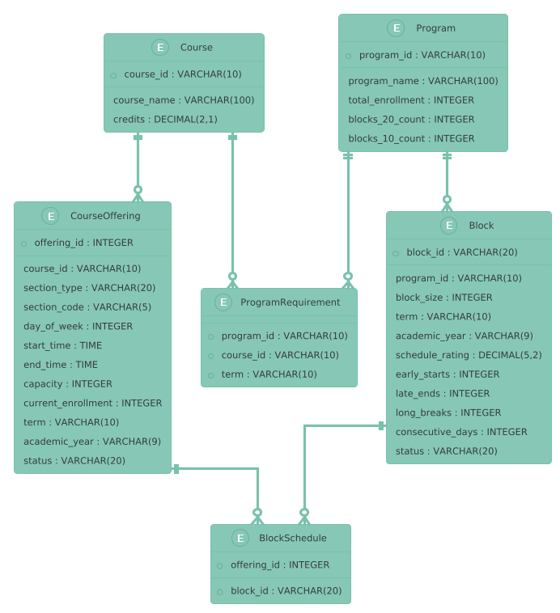

## Core Tables

### Course
This table stores information about individual courses offered by the institution.
- **course_id**: Unique identifier for each course (e.g., ECOR1041)
- **course_name**: Full name of the course
- **credits**: Number of credits for the course

### Program
Stores information about academic programs and their block requirements.
- **program_id**: Unique identifier for each program (e.g., ARCH)
- **program_name**: Full name of the program
- **total_enrollment**: Total number of students in the program
- **blocks_20_count**: Number of 20-student blocks needed
- **blocks_10_count**: Number of 10-student blocks needed

### CourseOffering
Represents specific sections of courses with their scheduling details.
- **offering_id**: Unique identifier for each course offering
- **course_id**: Reference to the Course table
- **section_type**: Type of section (e.g., LECTURE, LAB, TUTORIAL)
- **section_code**: Specific code for the section (e.g., A1, B2)
- **day_of_week**: Day of the week (1-5 for Monday to Friday)
- **start_time**: Start time of the class
- **end_time**: End time of the class
- **capacity**: Maximum number of students
- **current_enrollment**: Current number of enrolled students
- **term**: Academic term (e.g., FALL, WINTER)
- **academic_year**: Academic year (e.g., 2024-2025)
- **status**: Section status (default: OPEN, can be FULL)

### ProgramRequirement
Links courses to programs, specifying required courses for each term.
- **program_id**: Reference to the Program table
- **course_id**: Reference to the Course table
- **term**: Term when the course should be taken

### Block
Represents groups of students (10 or 20) with their schedule quality metrics.
- **block_id**: Unique identifier for each block
- **program_id**: Reference to the Program table
- **block_size**: Size of the block (10 or 20 students)
- **term**: Academic term
- **academic_year**: Academic year
- **schedule_rating**: Quality rating of the schedule
- **early_starts**: Count of 8:30 AM starts
- **late_ends**: Count of after 18:00 ends
- **long_breaks**: Count of breaks longer than 3 hours
- **consecutive_days**: Count of consecutive full days
- **status**: Block status (default: DRAFT, can be PUBLISHED, LOCKED)

### BlockSchedule
Links blocks to specific course offerings, forming complete schedules.
- **block_id**: Reference to the Block table
- **offering_id**: Reference to the CourseOffering table

## Key Features

1. **Block-Based Scheduling**
   - Supports both 20 and 10-student blocks
   - Tracks schedule quality metrics
   - Manages block status (DRAFT, PUBLISHED, LOCKED)

2. **Schedule Quality Assessment**
   - Tracks early morning starts (8:30 AM)
   - Monitors late evening ends (after 18:00)
   - Counts long breaks between classes (>3 hours)
   - Tracks consecutive full days

3. **Enrollment Management**
   - Tracks current enrollment in course offerings
   - Enforces capacity limits
   - Monitors offering status (OPEN, FULL)

4. **Program Requirements**
   - Specifies term-specific course requirements for each program

5. **Course Offering Management**
   - Supports different section types (LECTURE, LAB, TUTORIAL)
   - Manages detailed scheduling information (day, time, capacity)
   - Tracks academic terms and years

6. **Unique Constraints**
   - Ensures unique course offerings per course, section type, code, term, and academic year
   - Guarantees unique blocks per program, term, and academic year