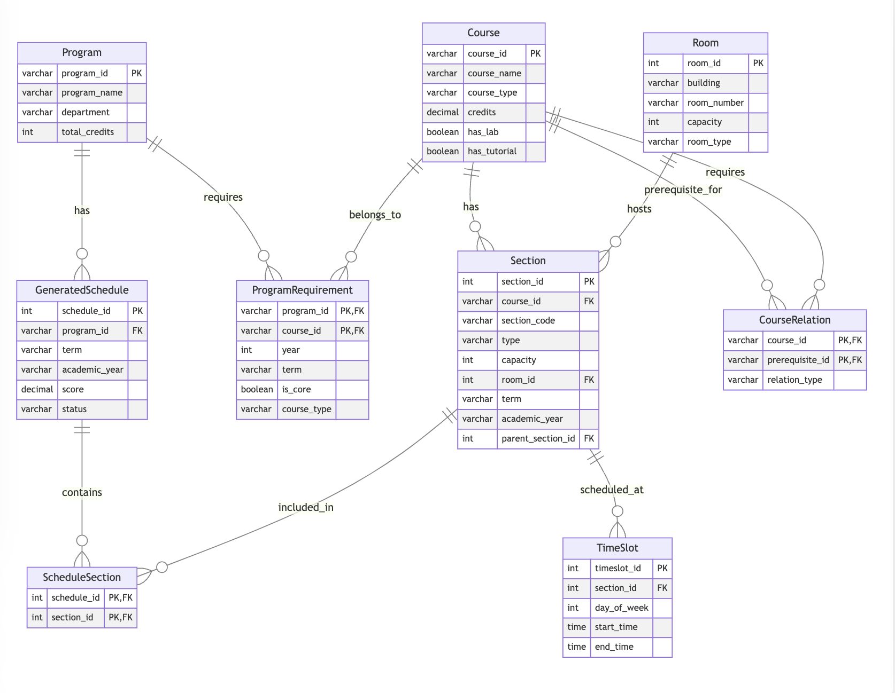

## Core Tables



### Course

This table stores information about individual courses offered by the institution.

- **course_id**: Unique identifier for each course (e.g., ECOR1041)
- **course_name**: Full name of the course
- **course_type**: Categorizes courses as CORE, ELECTIVE_B, or ELECTIVE_C
- **department**: Department offering the course
- **credits**: Number of credits for the course
- **has_lab** and **has_tutorial**: Boolean flags indicating if the course includes lab or tutorial components

```sql
CREATE TABLE Course (
    course_id VARCHAR(10) PRIMARY KEY, -- e.g., ECOR1041
    course_name VARCHAR(100) NOT NULL, -- e.g., Digital Systems
    course_type VARCHAR(20) NOT NULL, -- CORE, ELECTIVE_B, ELECTIVE_C
    department VARCHAR(20) NOT NULL, -- ECOR, MATH, PHYS, CHEM
    credits DECIMAL(2,1) NOT NULL, -- e.g., 0.5
    has_lab BOOLEAN DEFAULT false,
    has_tutorial BOOLEAN DEFAULT false
);
```

**courses.csv**
```
course_id,course_name,course_type,department,credits,has_lab,has_tutorial
ECOR1041,Digital Systems,CORE,ECOR,0.5,true,true
MATH1004,Calculus,CORE,MATH,0.5,false,true
PHYS1001,Mechanics,CORE,PHYS,0.5,true,true
CHEM1001,Chemistry,CORE,CHEM,0.5,true,true
ELEC2501,Circuits,CORE,ELEC,0.5,true,true
```

### Program

Stores information about academic programs offered by the institution.

- **program_id**: Unique identifier for each program (e.g., ELEC for Electrical Engineering)
- **program_name**: Full name of the program
- **department**: Department responsible for the program
- **year**: Academic year of the program

```sql
CREATE TABLE Program (
    program_id VARCHAR(10) PRIMARY KEY, -- e.g., ELEC, COMP
    program_name VARCHAR(100) NOT NULL, -- e.g., Electrical Engineering
    department VARCHAR(50) NOT NULL,
    year INTEGER DEFAULT 1
);
```

**programs.csv**
```
program_id,program_name,department,year
ELEC,Electrical Engineering,Systems Engineering,1
COMP,Computer Systems Engineering,Systems Engineering,1
MECH,Mechanical Engineering,Mechanical Engineering,1
```

### ProgramRequirement

Links courses to programs, specifying which courses are required for each program.

- Composite primary key of program_id, course_id, and term
- **is_required**: Indicates if the course is mandatory for the program

```sql
CREATE TABLE ProgramRequirement (
    program_id VARCHAR(10) REFERENCES Program(program_id),
    course_id VARCHAR(10) REFERENCES Course(course_id),
    term VARCHAR(10) NOT NULL, -- FALL, WINTER
    is_required BOOLEAN DEFAULT true,
    PRIMARY KEY (program_id, course_id, term)
);
```

**program_requirements.csv**
```
program_id,course_id,term,is_required
ELEC,ECOR1041,FALL,true
ELEC,MATH1004,FALL,true
ELEC,PHYS1001,FALL,true
COMP,ECOR1041,WINTER,true
COMP,MATH1004,FALL,true
```

### Room

Contains information about available rooms for scheduling.

- **room_id**: Unique identifier for each room
- **building** and **room_number**: Location of the room
- **capacity**: Maximum number of students the room can accommodate
- **room_type**: Specifies if it's a LECTURE, LAB, or TUTORIAL room

```sql
CREATE TABLE Room (
    room_id INTEGER PRIMARY KEY,
    building VARCHAR(50) NOT NULL,
    room_number VARCHAR(20) NOT NULL,
    capacity INTEGER NOT NULL,
    room_type VARCHAR(20) NOT NULL, -- LECTURE, LAB, TUTORIAL
    UNIQUE(building, room_number)
);
```

**rooms.csv**
```
room_id,building,room_number,capacity,room_type
101,ME,3380,120,LECTURE
201,ME,3275,30,LAB
301,ME,3444,30,TUTORIAL
```

## Section and Schedule Tables

### Section

Represents individual course sections, including lectures, labs, and tutorials.

- **section_id**: Unique identifier for each section
- **course_id**: Links to the Course table
- **section_code**: Specific code for the section (e.g., A1, B2)
- **type**: Indicates if it's a LECTURE, LAB, or TUTORIAL
- **room_id**: Links to the Room table
- **parent_section_id**: Allows for linking related sections (e.g., lab to its parent lecture)

```sql
CREATE TABLE Section (
    section_id INTEGER PRIMARY KEY,
    course_id VARCHAR(10) REFERENCES Course(course_id),
    section_code VARCHAR(5) NOT NULL, -- e.g., A1, B2
    type VARCHAR(20) NOT NULL, -- LECTURE, LAB, TUTORIAL
    capacity INTEGER NOT NULL,
    room_id INTEGER REFERENCES Room(room_id),
    term VARCHAR(10) NOT NULL, -- FALL, WINTER
    academic_year VARCHAR(9) NOT NULL, -- e.g., 2024-2025
    parent_section_id INTEGER REFERENCES Section(section_id),
    UNIQUE(course_id, section_code, term, academic_year)
);
```

**sections.csv**
```
section_id,course_id,section_code,type,capacity,room_id,term,academic_year,parent_section_id
1,ECOR1041,A1,LECTURE,120,101,FALL,2024-2025,
2,ECOR1041,A2,LAB,30,201,FALL,2024-2025,1
3,ECOR1041,A3,TUTORIAL,30,301,FALL,2024-2025,1
4,MATH1004,A1,LECTURE,120,101,FALL,2024-2025,
5,MATH1004,A2,TUTORIAL,30,301,FALL,2024-2025,4
```

### TimeSlot

Stores the scheduling information for each section.

- **timeslot_id**: Unique identifier for each time slot
- **section_id**: Links to the Section table
- **day_of_week**: Day of the week (1-5 for Monday to Friday)
- **start_time** and **end_time**: Timing of the class

```sql
CREATE TABLE TimeSlot (
    timeslot_id INTEGER PRIMARY KEY,
    section_id INTEGER REFERENCES Section(section_id),
    day_of_week INTEGER NOT NULL, -- 1 (Monday) to 5 (Friday)
    start_time TIME NOT NULL,
    end_time TIME NOT NULL,
    UNIQUE(section_id, day_of_week, start_time)
);
```

**timeslots.csv**
```
timeslot_id,section_id,day_of_week,start_time,end_time
1,1,1,08:30,10:00
2,2,2,13:30,16:30
3,3,3,14:30,16:00
4,4,2,10:30,12:00
5,5,4,14:30,16:00
```

### GeneratedSchedule

Represents a generated schedule for a specific program, term, and academic year.

```sql
CREATE TABLE GeneratedSchedule (
    schedule_id INTEGER PRIMARY KEY,
    program_id VARCHAR(10) REFERENCES Program(program_id),
    term VARCHAR(10) NOT NULL,
    academic_year VARCHAR(9) NOT NULL,
    generation_date TIMESTAMP DEFAULT CURRENT_TIMESTAMP,
    score DECIMAL(5,2), -- Ranking score
    status VARCHAR(20) DEFAULT 'DRAFT', -- DRAFT, PUBLISHED
    UNIQUE(program_id, term, academic_year)
);
```

- **schedule_id**: Unique identifier for each generated schedule
- **program_id**: Links to the Program table
- **score**: Allows for ranking of generated schedules
- **status**: Indicates if the schedule is a DRAFT or PUBLISHED

**generate_schedule.csv**
```
schedule_id,program_id,term,academic_year,score,status
1,ELEC,FALL,2024-2025,95.5,PUBLISHED
2,COMP,FALL,2024-2025,87.3,DRAFT
```

### ScheduleSection

Links generated schedules to specific sections, forming the complete schedule.

```sql
CREATE TABLE ScheduleSection (
    schedule_id INTEGER REFERENCES GeneratedSchedule(schedule_id),
    section_id INTEGER REFERENCES Section(section_id),
    PRIMARY KEY (schedule_id, section_id)
);
```

- Composite primary key of schedule_id and section_id

**schedule_sections.csv**
```
schedule_id,section_id
1,1
1,2
1,3
1,4
1,5
```

## Example Schedule

```json
{
  "schedule": {
    "schedule_id": 1,
    "program_id": "ELEC",
    "term": "FALL",
    "academic_year": "2024-2025",
    "score": 95.5,
    "status": "PUBLISHED",
    "sections": [
      {
        "section_id": 1,
        "course": {
          "course_id": "ECOR1041",
          "course_name": "Digital Systems",
          "course_type": "CORE",
          "department": "ECOR",
          "credits": 0.5,
          "has_lab": true,
          "has_tutorial": true
        },
        "section_code": "A1",
        "type": "LECTURE",
        "capacity": 120,
        "room": {
          "room_id": 101,
          "building": "ME",
          "room_number": "3380",
          "capacity": 120,
          "room_type": "LECTURE"
        },
        "timeslot": {
          "timeslot_id": 1,
          "day_of_week": 1,
          "start_time": "08:30",
          "end_time": "10:00"
        }
      },
      {
        "section_id": 2,
        "course": {
          "course_id": "ECOR1041",
          "course_name": "Digital Systems",
          "course_type": "CORE",
          "department": "ECOR",
          "credits": 0.5,
          "has_lab": true,
          "has_tutorial": true
        },
        "section_code": "A2",
        "type": "LAB",
        "capacity": 30,
        "room": {
          "room_id": 201,
          "building": "ME",
          "room_number": "3275",
          "capacity": 30,
          "room_type": "LAB"
        },
        "timeslot": {
          "timeslot_id": 2,
          "day_of_week": 2,
          "start_time": "13:30",
          "end_time": "16:30"
        }
      },
      {
        "section_id": 3,
        "course": {
          "course_id": "ECOR1041",
          "course_name": "Digital Systems",
          "course_type": "CORE",
          "department": "ECOR",
          "credits": 0.5,
          "has_lab": true,
          "has_tutorial": true
        },
        "section_code": "A3",
        "type": "TUTORIAL",
        "capacity": 30,
        "room": {
          "room_id": 301,
          "building": "ME",
          "room_number": "3444",
          "capacity": 30,
          "room_type": "TUTORIAL"
        },
        "timeslot": {
          "timeslot_id": 3,
          "day_of_week": 3,
          "start_time": "14:30",
          "end_time": "16:00"
        }
      },
      {
        "section_id": 4,
        "course": {
          "course_id": "MATH1004",
          "course_name": "Calculus",
          "course_type": "CORE",
          "department": "MATH",
          "credits": 0.5,
          "has_lab": false,
          "has_tutorial": true
        },
        "section_code": "A1",
        "type": "LECTURE",
        "capacity": 120,
        "room": {
          "room_id": 101,
          "building": "ME",
          "room_number": "3380",
          "capacity": 120,
          "room_type": "LECTURE"
        },
        "timeslot": {
          "timeslot_id": 4,
          "day_of_week": 2,
          "start_time": "10:30",
          "end_time": "12:00"
        }
      }
    ]
  }
}
```